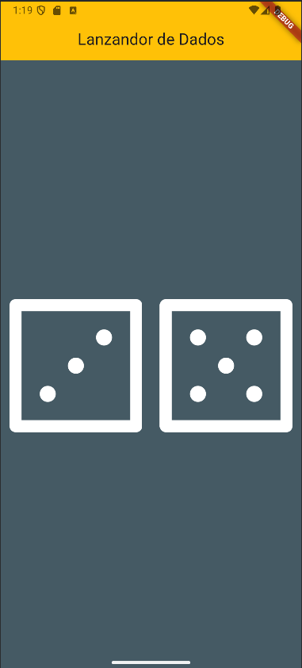

# 🎲 Lanzador de Dados Flutter

---

## 📌 Descripción General

**lanzador_dados_flutter** es una aplicación móvil desarrollada con Flutter que simula el lanzamiento de dos dados. Al presionar cualquiera de ellos, ambos cambian aleatoriamente mostrando una nueva cara. 

---

## 👁 Vista App
<p align="center">
  
</p>

---

## ✅ Funcionalidades Principales

- Simulación visual de dos dados interactivos.
- Cambio aleatorio del valor de los dados al presionar cualquiera de ellos.
- Visualización de imágenes dinámicas (`dice1.png` a `dice6.png`) según el número obtenido.
- Interfaz gráfica atractiva y adaptable a distintas pantallas.

---

## ⚙️ Requisitos del Proyecto

- [Flutter SDK](https://flutter.dev/docs/get-started/install)
- [Dart SDK](https://dart.dev/get-dart) (incluido con Flutter)
- Un editor compatible como [Android Studio](https://developer.android.com/studio) o [Visual Studio Code](https://code.visualstudio.com/)
- Emulador o dispositivo físico Android/iOS

---

## 🧰 Tecnologías y Paquetes Utilizados

- **Flutter** – Framework de desarrollo multiplataforma.
- **Dart** – Lenguaje de programación.
- **`dart:math`** – Para generación de números aleatorios.

---

## 📁 Estructura del Proyecto

```
lanzador_dados_flutter/
├── android/              # Archivos de configuración para Android
├── ios/                  # Archivos de configuración para iOS
├── lib/
│   └── main.dart         # Código principal de la aplicación
├── images/               # Imágenes de los dados
│   ├── dice1.png
│   ├── dice2.png
│   ├── dice3.png
│   ├── dice4.png
│   ├── dice5.png
│   └── dice6.png
├── pubspec.yaml          # Archivo de configuración del proyecto
└── README.md             # Documentación del proyecto
```
---

## 👤 Autor

Desarrollado por **María José Mendieta Ortiz**   
🌐 https://github.com/MariaJoseMendieta

